# Machine Learning Engineer Nanodegree
## Capstone Project

Chuan Hong

December 28, 2018

## I. Definition

### Project Overview

Generative Adversarial Networks (GANs), are a framework first proposed by Ian J. Goodfellow[^i.goodfellow] in 2014. GANs are usually trained to generate new samples similar to the training samples by teaching a DL model to estimate the training data’s distribution. GANs have become one of the most popular topic on both research side and application side in the deep learning community for its various applications in image/video generation, image-to-image translation, style transfer, etc. 

A typical GAN usually includes two separate networks being trained simultaneously: a generative model, called the generator or **G**, captures the data distribution and produces "fake" samples, and a discriminative model, called the discriminator or **D**, estimates the probability that a sample came from the training data rather than the generator. In this project, we implemented several GANs frameworks using *pyTorch* and compared their performance on three simple image datasets, MNIST[^MNIST], FashionMNIST[^Fashion-MNIST], and CartoonSet10k[^CartoonSet10k]. 

### Problem Statement

Although GANs have been successful in the field of image generation, training process instabilities remains a significant issue[^m.lucic]. When using gradient descent techniques to train GANs, the algorithm may oscillate, destabilize, and fail to converge for many games.[^l.metz] Other issues that GAN models may suffer include Model collapse, disminished gradient, etc.

While a theoretical understanding is needed to improve the fundamental stability of GANs[^m.arjovsky], there are a variety of approaches that might help with GAN training issues[^t.salimans]. In this project we will experiment several different network architecures, cost functions, and other implementation tips on image data and compare their results.

Due to the limited time frame of the project, we were only be able to implement the following 4 types of GANs. Other promising GANs and designs can be easily added to the existing framework and will be implemented in the near future.

- **vanilla GAN** (vanillaGAN): the original GAN which uses linear layers in both G and D, respectively.
- **conditional GAN** (cGAN)[^m.mirza]: the conditional version of vanilla GAN, which feeds the target y on to both the G and D.
- **deep convolutional GAN** (DCGAN)[^a.radford]: a direct extension of the vanilla GAN which uses convolutional and convolutional-transpose layers in the D and G, respectively.
- **conditional DCGAN**: the conditional version of DCGAN.

### Metrics

GANs lack an objective function, which makes it difficult to compare performance of different models. Although several measures have been introduced, there is still no consensus as to which measure should be used for fair model comparison. In this porject, we directly compared the generated sample images at different epochs across different GANs. 

Fréchet Inception Distance (FID score)[^m.heusel]  is a measure of similarity between two datasets of images. Many recent researches suggest that the FID score is a reasonable metric due to its robustness with respect to mode dropping and encoding network choices[^m.lucic]. 

In addition to directly compare the generated images by humans, we also provided FID scores for each model.

## II. Analysis

### Data Exploration

Below is a summary of the datasets used in the project. The MNIST and Fashion-MNIST datasets are loaded directly from `torchvision.datasets`. A customized dataset Class was implemented for loading both images and labels of CartoonSet. 

1. MNIST[^MNIST]
	- The MNIST database of handwritten digits has a training set of 60,000 examples, and a test set of 10,000 examples. 
	- The digits have been size-normalized and centered in a 28x28 grayscale image.
	- The labels are digits ranged from 0 to 9
	
	
	*Fig. 1. Sample images from MNIST dataset*
	
2. Fashion-MNIST[^Fashion-MNIST]
	- Fashion-MNIST consists of a training set of 60,000 examples and a test set of 10,000 examples. 
	- Each example is a 28x28 grayscale image, associated with a label from 10 classes.
	- Target variable ranges from 0 to 9
	
	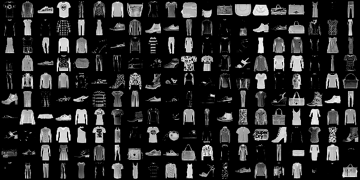
	*Fig. 2. Sample images from Fashion-MNIST dataset*
	
3. CartoonSet10k[^CartoonSet10k]
	- Each cartoon face in these sets is composed of 16 components that vary in 10 artwork attributes, 4 color attributes, and 4 proportion attributes. 
	- Colors are chosen from a discrete set of RGB values.
	- The dataset consists of 10k randomly chosen cartoons and labeled attributes from a total of ~10<sup>13</sup> possible combinations.
	- The cartoon faces have been centered and chopped in a 75x75 color image.
	- The list of attributes can be found via [https://google.github.io/cartoonset/download.html]()
	
	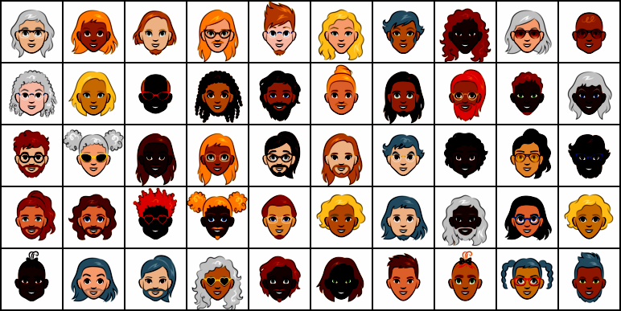
	*Fig. 3. Sample images from CartoonSet10k dataset*


### Algorithms and Techniques

Below is a brief introduction of the models and techniques we used in the project.

**vanilla GAN**

The main building blocks for vanilla GAN models are Linear layers (`nn.Linear`) and activation layers after each linear layer: 
	- for G, the output range is (-1, 1) and therefore we used `nn.Tanh` as the final activation layer
	- for D, the output range is (0, 1) and therefore the final activation layer is  `nn.Sigmoid`.
	- for hidden activation layers, `nn.ReLU` and `nn.LeakyReLU` are used for G and D respectively.

 In addition, the input of D and the output of G are both 4D tensors of shape (N, C, H, W), where N is a batch size, C denotes a number of channels, H is a height of input planes in pixels, and W is width in pixels. Hense we added a Flatten layer at the begining of D and a UnFlatten layer at the end of G.
 
The simplified network structures are:
	- G: `nn.Linear` &rightarrow; `nn.ReLU` &rightarrow; \[`nn.Linear` &rightarrow; `nn.BatchNorm1d` &rightarrow; `nn.ReLU`\] &rightarrow; ... &rightarrow; `nn.Linear` &rightarrow; `nn.Tanh` &rightarrow; `UnFlatten`
	- D: `Flatten` &rightarrow; \[`nn.Linear` &rightarrow; `nn.LeakyReLU`\] &rightarrow; ... &rightarrow; `nn.Linear` &rightarrow; `nn.Sigmoid`

Note: The \[...\] indicates a block that repeats multiple times in a network.  An normalization layer (`nn.BatchNorm1d`) was added after each hidden Linear layer in G.

**conditional GAN**

The structure of cGAN is similar to vanillaGAN except that the target variable is added to both G and D to provide additional information about the image. To add the target variable y, we first encoded it using one hot encoding and then concatenated with the input before feeding to the networks.

**deep convolutional GAN**

The main difference between DCGAN and vanillaGAN is DCGAN uses convolutional layers in D for down sampling and 2D transposed convolutional layers in G for up sampling instead of linear layers. Besides, the Flatten layer is added to the end of D and the UnFlatten layer is added to the beginning of G since the data remains a 4D tensor throughout the convolutional layers.

The simplified network structures are:
	- G: `UnFlatten` &rightarrow; \[`nn.ConvTranspose2d` &rightarrow; `nn.BatchNorm2d` &rightarrow; `nn.ReLU`\] &rightarrow; ... &rightarrow; `nn.ConvTranspose2d` &rightarrow; `nn.Tanh`
	- D: `nn.Conv2d` &rightarrow; `nn.LeakyReLU` &rightarrow; \[`nn.Conv2d` &rightarrow; `nn.BatchNorm2d` &rightarrow; `nn.LeakyReLU`\] &rightarrow; ... &rightarrow; `nn.Conv2d` &rightarrow; `nn.Sigmoid` &rightarrow; `Flatten`
	
**conditional DCGAN**

A conditional version of DCGAN. 
	- In G, the one-hot encoded target was concatenated with the input before feeding to the convolutional layers. 
	- In D, we first feed the input to the convolutional layer and then concatenate the output with the target variable. We then apply another linear layers to it to get the final output.
	
**Loss**

We chose the Binary Cross Entropy loss `nn.BCELoss` for both G and D:

$$\ell_G  =  -\mathbb{E}_{z \sim p(z)}\left[\log D(G(z))\right]$$

$$ \ell_D = -\mathbb{E}_{x \sim p_\text{data}}\left[\log D(x)\right] - \mathbb{E}_{z \sim p(z)}\left[\log \left(1-D(G(z))\right)\right]$$


**Training**

There are two steps to train a GAN. The pseudo code below descirbes how GAN is trained:
```
for each epoch:
	for each mini_batch:
	 	# generate random noize
		generate random_noise of the same batch size
		# generate fake samples
		fake_samples = G(random_noise)
		# update network D
		loss_real = loss(D(real_samples), 1)
		loss_fake = loss(D(fake_samples), 0)
		d_loss = loss_real + loss_fake
		update parameters in D by minimizing d_loss with G fixed
		# update network G
		g_loss = loss(D(fake_samples), 1)
		update parameters in G by minimizing g_loss with D fixed
``` 

### Benchmark

We use the vanilla GAN as our benchmark model. Since implementing FID is not a trivial task, we will use an existing implementation[^mseitzer] and calculate the FID scores based on a random sample of 2048 images from the original data and from the model G.

## III. Methodology

### Data Preprocessing

`torchvision` provides very powerful APIs for loading and preprocessing image data. The MNIST and FashionMNIST have very similar structure and are loaded directly from `torchvision.datasets`. The original datasets are in the range of [0, 1], so I transformed it to [-1, 1] by applying the `Normalize(mean=0.5, std=0.5)` transformation.

For the CartoonSet, each image is associated with a csv file which includes the 13 attributes of that image. Therefore I implemented a data class `CartoonSet` inherited from `data.Dataset` for loading both images and labels of CartoonSet. The cartoon faces then were centered and chopped into a 75x75 color image. Finally the same normalization was applied to produce data in the range of [-1, 1].


### Implementation

The implementation can be split into two main parts: The module, which includes the implementation of all reusable models, layers, functions, etc, and the notebooks, which focus on high level end-to-end workflow.

The gans module is organized as:

- model
	* vanillaGAN: `Generator`, `Discriminator`
	* conditionalGAN: `ConditionalGenerator`, `ConditionalDiscriminator`
	* dcGAN: `DCGenerator`, `DCDiscriminator`
	* conditionalDCGAN: `CondDCGenerator`, `CondDCDiscriminator`
- utils
	* data: `CartoonSet`
	* functions: `gif_generator`, `weights_init`
	*layers: `Flatten`,  `Unflatten2d`, `OneHotEncoder`
- trainer: `GANTrainer`, `CGANTrainer`

The notebooks all follow the same workflow:

import libraries &rightarrow; set parameters &rightarrow; load dataset &rightarrow; create G and D &rightarrow; train models &rightarrow; generate charts/images


### Refinement

In this project, a great amount of effort has been spent on testing different neural network structures and adjusting the parameters for the neural network layers. Most of the tests fail to generate valid images or crush during the training process with no clear reasons. 

Besides, I also tried to make the models adjustable to different image sizes. The current implementation can be applied to the three datasets we mentioned above without the need of custimization.


## IV. Results


### Model Evaluation and Validation

The FID scores for MNIST and FashionMNIST are summarized in the table below (yhe smaller the better). The models collapsed when using CartoonSet after training for a few batches and therefore we did not evaluated their FID scores.

| dataset | VanillaGAN | cGAN | DCGAN | cDCGAN |
|-----------|-----------------|-----------|---------|------------|
| MNIST | 29.8860039314948 | 27.60618076139116 | 7.548617460620278 | 7.420052673632085 |
| FashionMNIST | 55.893088118384526 | 60.76478200199051 | 13.996017101103291 | 13.584223451920764 |

We now compare the performance of different GAN models by showing the generated images and the training losses.

**MNIST**
 
1. VanillaGAN
  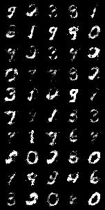 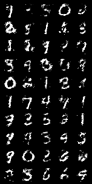 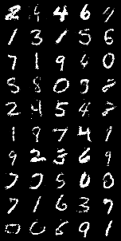
*Fig. 4a. Sample images after epoch 1, 5, 10, 20, and 50*

*Fig. 4b. Training losses for G and D*

2. DCGAN
 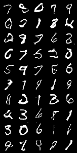 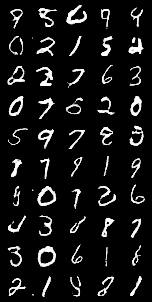 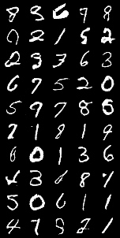 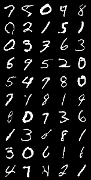
*Fig. 5a. Sample images after epoch 1, 5, 10, 20, and 50*

*Fig. 5b. Training losses for G and D*

3. cGAN
    
*Fig. 6a. Sample images after epoch 1, 5, 10, 20, and 50*
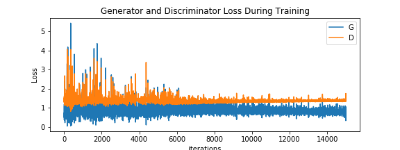
*Fig. 6b. Training losses for G and D*

4. conditional DCGAN
 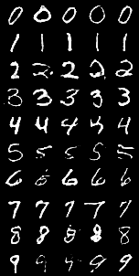 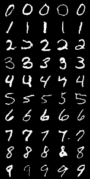 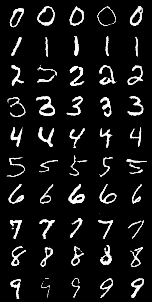 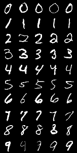
*Fig. 7a. Sample images after epoch 1, 5, 10, 20, and 50*
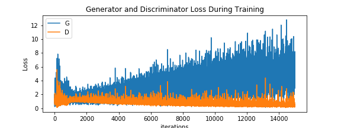
*Fig. 7b. Training losses for G and D*

**FashionMNIST**

1. VanillaGAN
    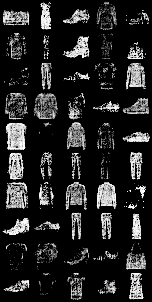
*Fig. 8a. Sample images after epoch 1, 5, 10, 20, and 50*

*Fig. 8b. Training losses for G and D*

2. DCGAN
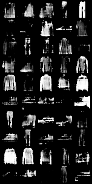 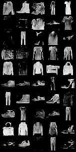 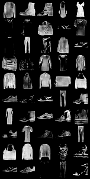   
*Fig. 9a. Sample images after epoch 1, 5, 10, 20, and 50*
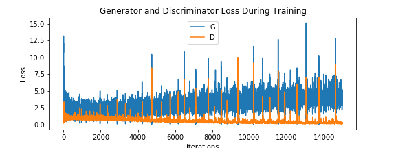
*Fig. 9b. Training losses for G and D*

3. cGAN
  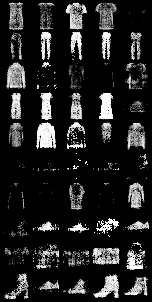 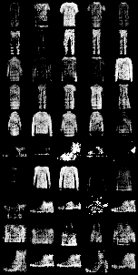 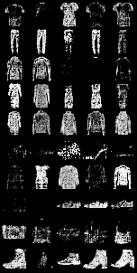
*Fig. 10a. Sample images after epoch 1, 5, 10, 20, and 50*

*Fig. 10b. Training losses for G and D*

4. conditional DCGAN
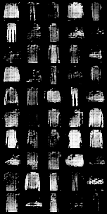 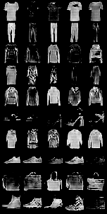  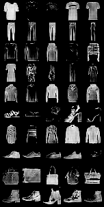 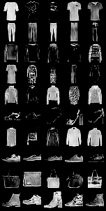
*Fig. 11a. Sample images after epoch 1, 5, 10, 20, and 50*
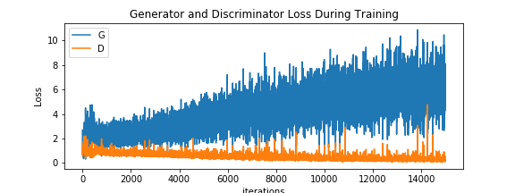
*Fig. 11b. Training losses for G and D*

**CartoonSet**

1. VanillaGAN
 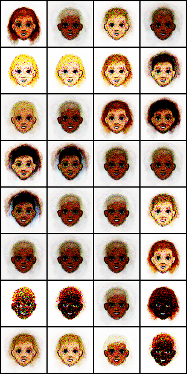 
*Fig. 12a. Sample images after epoch 5, 20, and 50*
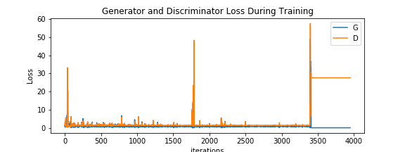
*Fig. 12b. Training losses for G and D*

2. DCGAN
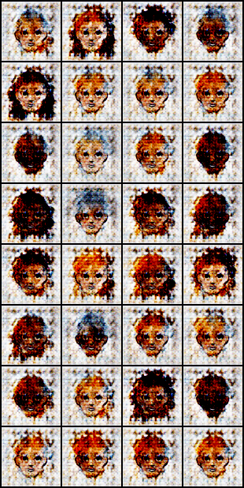 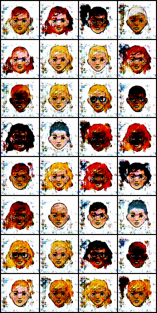 
*Fig. 13a. Sample images after epoch 5, 20, and 50*

*Fig. 13b. Training losses for G and D*

### Justification

By comparing the results of different models with the benchmark model, we can see that:

1. The images generated from the vanilla GAN, our benchmark model, which only includes fully connected linear layers, are noisy and not quite stable.
2. Adding conditions to G and D can generate images conditioned on class labels, which allows users to generate images that they want. In addition, it may also improve the image quality.
3. The deep convolutional version GANs in general outperform the original GANs. The images generated from DCGANs are less noisy, have sharper boundaries and brighter colors.

However, we also observe the model collapse issues in some cases in which the losses are no longer changing after several epochs.  (see *Fig. 4b* and *Fig. 12b*) 


## V. Conclusion


### Free-Form Visualization

Here we include the animated GIFs to show the training process of different GANs on MNIST dataset (only available on html and markdown).

 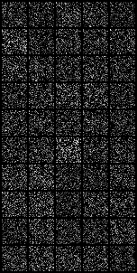  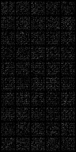
*Fig. 14. animated model performance at different epoch. From left to right: vanillaGAN, cGAN, DCGAN, cDCGAN*

### Reflection

It's been more than a month since I started the capstone project. My reflection throughout the entire project can be summarized as:

1. A comprehensive literature review. The initial literature review helped me to choose GANs as my capstone topic and also get familiar with the topic. 
2. Choosing and learning pyTorch. Althrought tensorflow is still the most popular deeplearning framework, however I always feel it's not quite pythonic and quite hard for me to get used to it. After exploring various DL packages, i found that pyTorch is more promising and much easier to learn. It also saved me a lot of time configuring and debugging the models.
3. Plan ahead. Writing the proposal helped me to better understand the project itself and also anticipate the risks and challenges. 
4. Reading documentations, source code from GitHub. Get started with something you aren't familiar with is hard. During the project, I've spent a good amount of time reading pyTorch documentations, seaching related implementation on GitHub, which helped me a lot in terms of understaning how GANs work and how to implement neural network models.
5. Reusing code is always the goal.

### Improvement

There're several improvements we can make in the furture:

1. Implement other GANs, such as Least Squares GAN and Wasserstein GAN.
2. Test different network structures and different hyper parameters.
3. Make the code adjustable to different image sizes and try different image dataset and video dataset. 
4. Try different applications using GANs, for example video frames generation, style transfer, etc.

-----------

### Reference
[^i.goodfellow]: Goodfellow, Ian, Jean Pouget-Abadie, Mehdi Mirza, Bing Xu, David Warde-Farley, Sherjil Ozair, Aaron Courville, and Yoshua Bengio. "Generative adversarial nets." In Advances in neural information processing systems, pp. 2672-2680. 2014.
[^MNIST]: THE MNIST DATABASE of handwritten digits [http://yann.lecun.com/exdb/mnist/]()
[^Fashion-MNIST]: Fashion-MNIST [https://github.com/zalandoresearch/fashion-mnist]()
[^CartoonSet10k]: Cartoon Set 10K [https://google.github.io/cartoonset/]()
[^m.lucic]: Lucic, Mario, Karol Kurach, Marcin Michalski, Sylvain Gelly, and Olivier Bousquet. "Are gans created equal? a large-scale study." In Advances in neural information processing systems, pp. 698-707. 2018.
[^l.metz]: Metz, Luke, Ben Poole, David Pfau, and Jascha Sohl-Dickstein. "Unrolled generative adversarial networks." arXiv preprint arXiv:1611.02163 (2016).

[^m.arjovsky]: Arjovsky, Martin, and Léon Bottou. "Towards principled methods for training generative adversarial networks." arXiv preprint arXiv:1701.04862 (2017).
[^t.salimans]: Salimans, Tim, Ian Goodfellow, Wojciech Zaremba, Vicki Cheung, Alec Radford, and Xi Chen. "Improved techniques for training gans." In Advances in Neural Information Processing Systems, pp. 2234-2242. 2016.

[^m.mirza]: Mirza, Mehdi, and Simon Osindero. "Conditional generative adversarial nets." arXiv preprint arXiv:1411.1784 (2014).
[^a.radford]: Radford, Alec, Luke Metz, and Soumith Chintala. "Unsupervised representation learning with deep convolutional generative adversarial networks." arXiv preprint arXiv:1511.06434 (2015).
[^m.heusel]: Heusel, Martin, Hubert Ramsauer, Thomas Unterthiner, Bernhard Nessler, Günter Klambauer, and Sepp Hochreiter. "Gans trained by a two time-scale update rule converge to a nash equilibrium." arXiv preprint arXiv:1706.08500 12, no. 1 (2017).
[^mseitzer]: Github Repo: [mseitzer/pytorch-fid](https://github.com/mseitzer/pytorch-fid)
